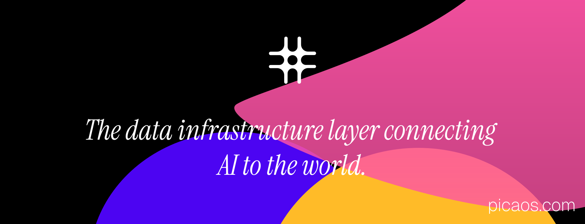

  

<b>Pica</b> - <i>Ensuring outcomes for the AI-first world</i>

  <b>
    <a href="https://www.picaos.com">Website</a>
    ·
    <a href="https://docs.picaos.com">Documentation</a>
    ·
    <a href="https://app.picaos.com">Dashboard</a>
    ·
    <a href="https://docs.picaos.com/changelog">Changelog</a>
    ·
    <a href="https://x.com/picahq">X</a>
    ·
    <a href="https://www.linkedin.com/company/picahq">LinkedIn</a>
  </b>

---

Connect LLMs to 25,000+ actions with Pica-verified knowledge and developer-friendly SDKs. No keys, no configs, no headaches.

Pica makes it simple to build and manage AI agents with 3 key products:
1. **OneTool**: Connect agents to over [150+ integrations](https://picaos.com/integrations) with a single SDK. Zero-shot execution that gets smarter with every use.
2. **AuthKit**: Streamline authentication for multi-tenant applications with secure, end-to-end OAuth flows and automated token management. Handles the complexity of authentication so you don't have to.
3. **BuildKit**: Empower vibe coding with integrations that work zero-shot.

Built in Rust for blazing speed and ultra-low latency execution. Full logging and action traceability gives developers complete visibility into their agents' decisions and activities. Our tools simplify building and running AI agents so developers can focus on results.