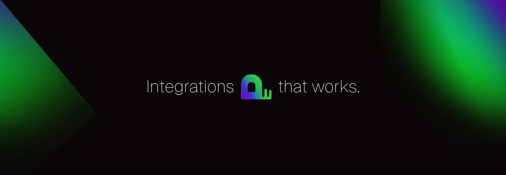

  

<b>Pica, The AI Integrations Solution</b>

  <b>
    <a href="https://www.picaos.com/">Website</a>
    ·
    <a href="https://docs.picaos.com">Documentation</a>
    ·
    <a href="https://app.picaos.com">Dashboard</a>
    ·
    <a href="https://docs.picaos.com/changelog">Changelog</a>
    ·
    <a href="https://x.com/picahq">X</a>
    ·
    <a href="https://www.linkedin.com/company/picahq">LinkedIn</a>
  </b>

---

Pica gives every builder instant, reliable access to the tools they need—no keys, no configs, no headaches.

Pica makes it simple to build and manage AI agents with 3 key products:
1. **OneTool**: Connect agents to over [100+ APIs and tools](https://app.picaos.com/tools) with a single SDK.
2. **AuthKit**: Securely manage authentication for tool integration.
3. **BuildKit**: Empower vibe coding with integrations that work zero-shot.

Pica also provides full logging and action traceability, giving developers complete visibility into their agents’ decisions and activities. Our tools simplify building and running AI agents so developers can focus on results.
